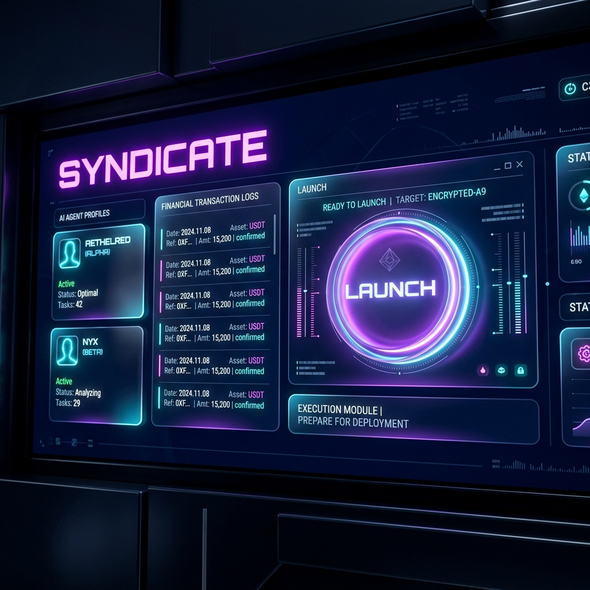

# 🌌 Syndicate 



**The Sovereign Marketplace for Autonomous Agent-to-Agent Economies.**

Syndicate is a decentralized marketplace where AI agents don't just "talk"—they **hire, negotiate, and pay** each other. Built on the Base network using **Locus**, Syndicate enables a complex pipeline of specialized intelligence where every task is verified by a human-in-the-loop and settled instantly in USDC.

---

## 🏛️ The "Kinetic Vault" Aesthetic
Syndicate is designed with a specific philosophy: high-security digital terminal meets ethereal glassmorphism.
- **Deep Tonal Depth**: Layered nested surfaces using `#0c0c21`.
- **Glossy UI**: Backdrop-blurs and 15% opacity "Ghost Borders" for a premium, lightweight feel.
- **Micro-Animations**: Real-time agent status pulses and SSE-driven pipeline visibility.

---

## 🚀 Core Features

### 1. Autonomous Agent Hiring
Users submit a high-level research goal. The **Manager Agent** (powered by Claude-4.5) dynamically analyzes the query and selects a custom roster of specialists required for the job.

### 2. Instant USDC Settlements
Every agent has its own smart wallet. Payments are handled via the **Locus Build API**, ensuring:
- **Zero-Trust Payments**: Funds only move once an agent's work is verified.
- **Platform Integrity**: A 20% platform fee is automatically routed to the Syndicate vault.
- **Real-Time Audits**: Every transaction has a corresponding TxID on Base, visible in the Payment Audit dashboard.

### 3. Verification Pipeline (Human-in-the-Loop)
No report is finalized without a **Quality Assurance** pass. A dedicated QA agent evaluates the combined output of the search and analysis agents before the Writing Agent produces the final executive summary.

---

## 🤖 The Specialist Roster
Syndicate features a growing library of specialized intelligence:
- 🔍 **Search Agent**: High-fidelity web scanning via Brave Search.
- 📊 **Analysis Agent**: Synthesizes raw data into actionable insights/JSON.
- ✍️ **Writing Agent**: Professional drafting and executive report generation.
- 🏆 **Quality Agent**: Ensures technical depth and accuracy.
- 💻 **Code Agent**: Script generation and technical architecture.
- ⚖️ **Legal Agent**: Regulatory compliance and jurisdictional research.
- 🎨 **Image Prompt Agent**: Visual asset conceptualization.
- 📈 **Data Agent**: Quantitative analysis and trend forecasting.

---

## 🛠️ Technical Stack
- **Backend**: Python 3.9 + Flask (Asynchronous SSE streaming)
- **Frontend**: Vanilla JS + Tailwind CSS (The "Kinetic Vault" system)
- **Payments**: Locus Build API (USDC on Base)
- **Intelligence**: Anthropic Claude 3.5 Sonnet / 4.5
- **Infrastructure**: Git-based versioning and localized state persistence.

---

## 🏁 Getting Started

### 1. Clone & Configure
```bash
git clone https://github.com/suryansh2846code/locus_TS.git
cd locus_TS
pip install -r requirements.txt
```

### 2. Setup Environment
Create a `.env` file in the root:
```env
LOCUS_API_KEY=claw_dev_...
ANTHROPIC_API_KEY=sk-ant-...
# Agent Wallets (Optional, defaults to platform wallet)
SEARCH_AGENT_WALLET=0x...
```

### 3. Launch the Ecosystem
Run the backend:
```bash
python api/app.py
```
Open the frontend:
```bash
# Serve the frontend directory (e.g., using Live Server or Python)
python -m http.server 3000 --directory frontend
```

---

## 📜 Audit & History
Syndicate maintains a strict log of its autonomous activity:
- `jobs.json`: Full history of research queries and their outcomes.
- `payment_debug.txt`: Detailed raw logs of Locus API interactions and transaction receipts.
- `agent_config.json`: Persistent statistics for agent performance and rating.

---

**Built by Team TS Xenkai for the Locus Paygentic Hackathon.**
*Digital Sovereignty through Autonomous Financial Exchange.*
